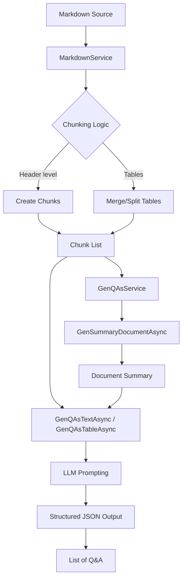

# MarkdownGenQAs - Markdown to QA Generation System

Dự án này là một hệ thống backend được xây dựng bằng .NET 9, chuyên xử lý các tài liệu Markdown để trích xuất thông tin và chuyển đổi thành bộ câu hỏi và câu trả lời (Q&A) một cách tự động sử dụng sức mạnh của các Large Language Models (LLM).

## 🏗 Kiến trúc Hệ thống (Service Architecture)

Hệ thống được thiết kế theo kiến trúc phân lớp, tách biệt giữa logic xử lý văn bản, tích hợp LLM và các dịch vụ bổ trợ.

### 1. Lớp Interface (Contracts)
Nằm trong thư mục `Interfaces/`, định nghĩa các bản thiết kế cho service:
- `IMarkdownService`: Các phương thức xử lý cấu trúc Markdown.
- `IGenQAsService`: Các phương thức tạo Q&A.
- `ILlmChatCompletion`: Giao diện chung để tương tác với các LLM Provider khác nhau.

### 2. Lớp Logic (Services)
Nằm trong thư mục `Services/`, thực thi các nghiệp vụ chính:
- **MarkdownService**: 
    - Chia nhỏ document (chunking) dựa trên Header Hierarchy.
    - Xử lý các bảng (Tables) phức tạp, có khả năng gộp các bảng liên quan ở các trang khác nhau (sử dụng LLM để quyết định).
    - Sử dụng `TokenCountService` để đảm bảo mỗi chunk không vượt quá giới hạn token.
- **GenQAsService**: 
    - Nhận vào các chunk văn bản, summary của document.
    - Tạo Prompt và gọi LLM để sinh ra Q&A theo định dạng JSON Schema.
    - Có cơ chế Retry khi LLM trả về kết quả không mong muốn.
- **JsonService**: Hỗ trợ serialize/deserialize JSON và tạo JSON Schema cho prompts.

### 3. Lớp LLM Provider (Infrastructure/Services/llms)
Hệ thống hỗ trợ nhiều nhà cung cấp LLM thông qua lớp trừu tượng `LlmChatCompletionBase`:
- **NvidiaService**: Tích hợp với Nvidia NIM API.
- **VllmService**: Tích hợp với server chạy Vllm cục bộ hoặc tự triển khai.

### 4. Lớp Infrastructure & Factories
- **Infrastructure/Factories**: 
    - `LlmClientFactory`: Khởi tạo `ChatClient` (OpenAI SDK) tương ứng với từng provider.
    - `LlmServiceFactory`: Resolve đúng service thực thi (`NvidiaService` hoặc `VllmService`) dựa trên cấu hình trong `appsettings.json`.
- **ExternalServices**: `TokenCountService` gọi đến một API bên ngoài để đếm token chính xác theo tokenizer của model.

## 🚀 Luồng Xử lý Chính (Main Logic Flow)



## 🛠 Cách đăng ký và Sử dụng (DI & Resolution)

Dự án sử dụng **Keyed Services** để quản lý các provider LLM:
- Các `ChatClient` và `LlmChatCompletionBase` được đăng ký với Key tương ứng (`LlmProvider.Nvidia`, `LlmProvider.Vllm`).
- `LlmServiceFactory` sẽ chịu trách nhiệm `GetRequiredKeyedService` dựa trên cài đặt `UseModelProviderForGenQAs` trong config.

### Ví dụ lập trình Controller (Future Guide)
Khi viết Controller, bạn chỉ cần Inject các Interface chính:

```csharp
public class QAsController : ControllerBase 
{
    private readonly IMarkdownService _markdownService;
    private readonly IGenQAsService _genQAsService;

    public QAsController(IMarkdownService markdownService, IGenQAsService genQAsService)
    {
        _markdownService = markdownService;
        _genQAsService = genQAsService;
    }

    [HttpPost("generate")]
    public async Task<IActionResult> Generate([FromBody] string markdown)
    {
        // 1. Chia nhỏ văn bản
        var chunks = await _markdownService.CreateChunkDocument(markdown);
        
        // 2. Tạo summary (optional)
        var summary = await _genQAsService.GenSummaryDocumentAsync(markdown, "filename.md");

        // 3. Sinh Q&A cho từng chunk
        foreach(var chunk in chunks) {
            var qas = await _genQAsService.GenQAsTextAsync(chunk, summary, "filename.md");
            // ... lưu trữ hoặc trả về
        }
        
        return Ok();
    }
}
```

## ⚙️ Cấu hình (Configuration)
Thông tin quan trọng trong `appsettings.json`:
- `ChunkOption`: Cấu hình độ sâu header, max tokens, và provider muốn dùng.
- `LlmProviderOptions`: API Key, BaseUrl và Models cho từng provider (Nvidia, Vllm).
- `SystemPrompts`: Đường dẫn đến các file template prompt và system message.
